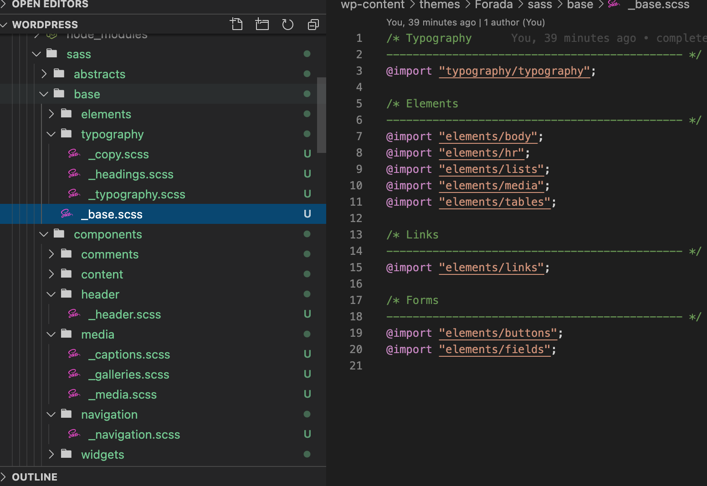

# 

<h1>Freelance Project: Forada</h1>
 
<h2>Problem: Forada wanted a personal website with the ability to update the content without the need for a developer.</h2>
 
<h2>Solution: Wordpress theme development allows me to create a personal theme while they can update the content.</h2>
 
| Contents                      |                                |
| ----------------------------- | ------------------------------ |
| 1. [Overview](#overview)      | 6. [Wins](#wins)   			 |
| 2. [Brief](#brief)            | 7. [Blockers](#blockers)       |
| 3. [Technologies used](#tech) | 8. [Bugs](#bugs)      		 |
| 4. [Site](#app)               | 9. [Future learnings](#learn)  |
| 5. [Approach](#approach)      | 								 |

 
 
<h2 name='overview'>Overview</h2>
 
<h3>Introduction</h3>
 
Forada Limited wanted a personalised website that they could update. Peregrine Communications designed the site and asked me to build it. They wanted no ability to scroll down, except for disclaimer pages.
 
<h3>Deployment</h3>
 
The site can be viewed currently on Peregrines test server: http://peregrine.design/forada  

<h2 name='brief'>Brief</h2>
 
- **Build the site to look like the deisgn giver**
- **No scroll** except when viewed on a phone and disclaimer pages
- **Allow no devs to update content**
 
<h2 name='tech'>Technologies used and why?</h2>
 
<strong>PHP</strong> wordpress uses PHP 
<strong>Wordpress</strong> because non-developers can update content. 
<strong>Advanced Custom Fields</strong> allows non-devs to update content on a personal theme. 
<strong>Underscores starter theme</strong> to allow me to create my own wordpress theme using Sass. 
<strong>JavaScript</strong> to build animations. 

<h2 name='app'>Site</h2>

The site has a nice design with no ability to scroll apart from view disclaimers or on a phone. It is fully responsive and contains interactive maps.     
     
     
     

<h2 name='approach'>Approach</h2>
My approach was to keep it simple. Use Sass with multiple files to make it easy for other devs to come in and work on it. Luckily Underscores has a really easy to understand layout.
      
 
 
<h2 name='wins'>Wins</h2>
<h3>PHP</h3>
This was my first time using PHP, I found it fairly easy. 
 
 
<h2 name='blockers'>Blockers</h2>
<h3>Advanced Custom Fields</h3>
This tricky to grasp at first, as the design of this plugin was poor.
 
 
<h2 name='bugs'>Bugs</h2>
<h3>No bugs for a client</h3>
It is unacceptable to have bugs in a finished piece for a client. 
 
 
<h2 name='learn'>Future learnings</h2>
• Learn more PHP. 
